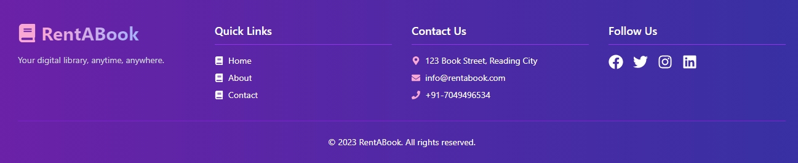

# RentABook

RentABook is an eBook rental platform built with React, TypeScript, Tailwind CSS, and Firebase for authentication. Users can register, log in, and rent books for different periods. Admins can manage books through a CRUD interface.

## Features

- User Authentication with Firebase (Email/Password and Google Sign-In)
- Book listing with CRUD operations for admin
- Secure rental service with Stripe integration
- Responsive UI using Tailwind CSS
- State management with React Context API

## Demo UI




## Technologies Used

- React
- TypeScript
- Tailwind CSS
- Firebase Authentication
- Stripe for Payments
- Axios for API calls

## Prerequisites

- Node.js and npm installed on your local machine

## Getting Started

### 1. Clone the Repository

```bash
git clone https://github.com/nik6348/RentABook-Frontend.git
cd RentABook-Frontend
```

2. Install dependencies:
   `npm install` or `npm i `

3. Start the server:
   `npm run dev` or `npm start`
